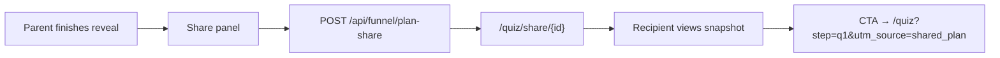

# Plan share virality — SAT Improvement Plan reveal

**Status:** Shipped in code + **prod DB migrated** (2026-06-01).

## Problem

Parents completing the Plan Builder want spouse/student alignment before booking a Strategy Call. A read-only share link turns one completion into a second household visit (or a friend’s) without exposing PII.

## Flow

## What gets shared

- **Included:** `PlanRevealModel` (projection, levers, next steps copy) — same as on-screen reveal.
- **Optional:** Child’s **first name only** (checkbox on reveal).
- **Never:** Email, phone, parent name, raw answers, Calendly state.

Links expire after **90 days** (`plan_shares.expires_at`).

## Recipient experience

| Element | Copy / behavior |
|--------|------------------|
| Title | `{First}'s SAT Improvement Plan` or generic snapshot |
| Body | Read-only `PlanRevealContent` + disclaimer |
| Primary CTA | **Build your child's Improvement Plan** → Plan Builder q1 |
| UTMs | `utm_source=shared_plan`, `utm_medium=referral`, `utm_content={shareId}` |

Expired links show a soft recovery CTA with `utm_source=shared_plan_expired`.

## Analytics (PostHog + GA)

| Event | When |
|-------|------|
| `plan_share_created` | Share link minted |
| `plan_share_link_copied` | Copy or native share completed |
| `plan_share_viewed` | Shared page loaded (client) |

Dashboard: filter funnel completions where `utm_source=shared_plan`; compare view → q1 start → s5 lead rate vs cold traffic.

## Ops checklist

1. ~~Run migration~~ Done — `plan_shares` table live on project `agujbietvwcudihfgkef`.
2. Confirm `NEXT_PUBLIC_SITE_URL` is `https://illuminairy.com` so share URLs are canonical.
3. Manual QA: complete reveal → copy link → open incognito → CTA starts fresh Plan Builder.
4. Optional later: OG image per share (dynamic), PDF export, “Send to student” SMS deep link.

## Messaging guardrails

- No score guarantees on shared page (`SHARE_PAGE_DISCLAIMER`).
- Say **Improvement Plan**, not quiz.
- Stats on shared page only if already in `PlanRevealModel` / `lib/site.ts` helpers — do not add new numbers in the share UI.

## Code map

| Piece | Path |
|-------|------|
| Share UI | `app/quiz/components/PlanSharePanel.jsx` |
| Reveal body | `app/quiz/components/PlanRevealContent.jsx` |
| Public page | `app/quiz/share/[id]/` |
| API | `app/api/funnel/plan-share/route.ts` |
| DB | `lib/crm/plan-shares.ts` |
| Copy | `lib/quiz-funnel/share-copy.ts` |
