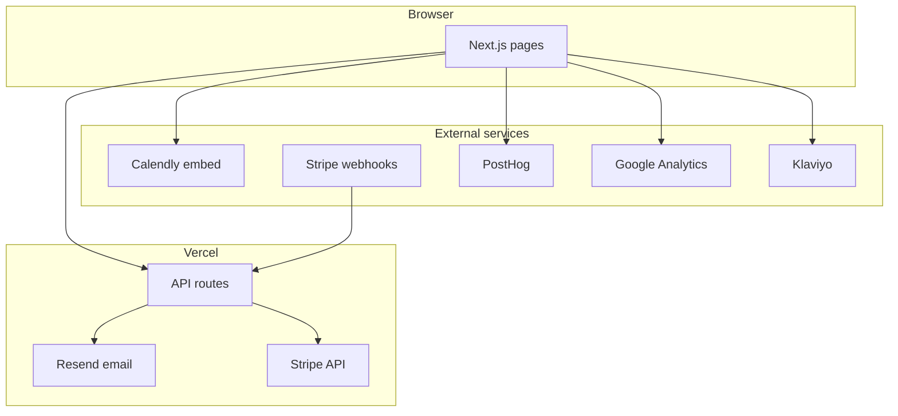

# Architecture — Illuminairy site

High-level map of the production codebase. For agent workflows see [`AGENTS.md`](../AGENTS.md); for product goals see [`memory-bank/projectbrief.md`](../memory-bank/projectbrief.md).

## System diagram

## Routes (pages)

| Path | Purpose |
|------|---------|
| `/` | Home, program cards, hero |
| `/sat-accelerator` | SAT program detail + schedule CTA |
| `/programs` | All programs (live + coming soon) |
| `/about` | Brand story |
| `/mentors` | Mentor narrative |
| `/contact` | Form + `#schedule` Calendly |
| `/enroll` | Stripe Checkout start |
| `/enroll/success` | Post-payment confirmation |
| `/privacy`, `/terms`, `/refund-policy`, `/support-policy` | Legal |

## API routes

| Route | Method | Integration |
|-------|--------|-------------|
| `/api/contact` | POST | Resend → inbox |
| `/api/newsletter` | POST | Klaviyo |
| `/api/checkout` | POST | Stripe Checkout session |
| `/api/webhooks/stripe` | POST | Stripe signature verify → handle completion |

## Core libraries

| Module | Role |
|--------|------|
| `lib/site.ts` | Site metadata, programs, marketing copy constants |
| `lib/sat-program-schedule.ts` | Week-by-week schedule for enroll UI |
| `lib/internal-links.ts` | Public consult path; private tutor Calendly URL |
| `lib/stripe.ts` | Stripe server client |
| `lib/posthog.ts` | Analytics init helpers |

## Component layers

- **Chrome:** `header.tsx`, `footer.tsx`, `logo.tsx`
- **Marketing blocks:** `accelerator-model.tsx`, `program-differentiation.tsx`, `brand-visual.tsx`
- **Integrations:** `contact-form.tsx`, `calendly-*.tsx`, `enroll-checkout.tsx`, `newsletter-signup.tsx`
- **Analytics:** `posthog-provider.tsx`, `google-analytics.tsx`, `klaviyo.tsx`
- **Primitives:** `ui.tsx`

## Data flow: enrollment

1. User completes consultation (external Calendly).
2. User visits `/enroll` → client calls `POST /api/checkout`.
3. Redirect to Stripe Checkout.
4. Stripe sends `checkout.session.completed` to `/api/webhooks/stripe`.
5. User lands on `/enroll/success`.

Tuition amount displayed on site must match `satProgram.tuitionCents` in `lib/site.ts` and Stripe `STRIPE_PRICE_ID`.

## Data flow: contact

1. User submits `components/contact-form.tsx`.
2. `POST /api/contact` validates and sends via Resend.
3. Optional `reason=mentor` query param categorizes mentor applications (no auto tutor Calendly).

## SEO & metadata

- Root metadata in `app/layout.tsx` using `site` from `lib/site.ts`
- `app/sitemap.ts`, `app/robots.ts`
- OG image: `public/og-image.svg`

## Non-production directories

| Path | Notes |
|------|-------|
| `docs/` | Brand and internal docs |
| `memory-bank/` | AI/human session context |
| `archives/` | Historical competitor captures — not deployed |
| `scripts/` | Ops helpers (env, Stripe, PostHog) |

## Deployment

- **Host:** Vercel (production branch → `illuminairy.com`)
- **Env:** `.env.local` → `npm run env:sync`
- **Build:** `npm run build` (webpack mode in scripts)

See [`README.md`](../README.md) for env variable reference.
