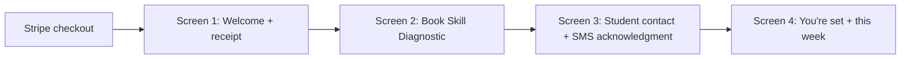
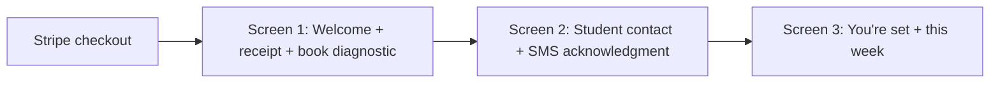

# /enroll UX design — post-payment onboarding

- **Status:** draft for Brianna review (not approved, not implemented)
- **Pipeline:** Research → this doc → [**gstack review**](./enroll-gstack-review.md) → [**visual mockups**](./enroll-design-mockups/board.html) → owner approval → PRD/SPEC → build
- **Research basis:** [`enroll-onboarding-research.md`](./enroll-onboarding-research.md)
- **Gstack review:** [`enroll-gstack-review.md`](./enroll-gstack-review.md) (CEO 6.5 · Design 6 · Eng 6)
- **Brand reference:** `~/Downloads/illuminairy_brand_guide (1).html` (editorial Aurora; adapted to light surface)
- **Supersedes:** `docs/enroll-design-pick.md` (agent draft; step count was never locked by owner)

## Job of this page

`/enroll` replaces Stripe's success redirect. The parent just paid a stranger on the internet. This page must:

1. **Confirm** what they bought (receipt + trial schedule + entity)
2. **Activate** the program (book Skill Diagnostic ASAP)
3. **Collect** accurate student contact + parent-on-behalf SMS acknowledgment
4. **Anchor** a named human they can come back to

Brand promise: easy, take work off the parent, diagnostic first, honest about SMS to the student, no scam anxiety.

---

## Research → design decisions

| Research pattern | Source | Our decision |
|------------------|--------|--------------|
| Post-pay screen must do receipt work, not flat "thanks" | Allbirds anti-pattern, Ritual/Hims | Dedicated **receipt zone** on screen 1, live from Stripe |
| Parents expect payment proof; health DTC replaces static page with useful work | Cerebral, Headway | Receipt + **book diagnostic** on first session (not receipt-only then 4 forms) |
| Booked first appointment = activation | Headway, ZocDoc, Cerebral | Skill Diagnostic booked = primary success metric |
| Don't gate activation on slowest field | Stripe Atlas parallel-track | Parent can book diagnostic **before** student consent submit completes |
| Parent = billing root; student = nested profile | Outschool, Greenlight | Parent prefilled from Stripe; student fields on a later screen |
| Guardian affirmation before child fields | Spotify Family, ZocDoc | Checkbox before student contact block |
| Separate parent vs student phones | Greenlight | Never reuse Stripe parent phone as student mobile |
| SMS to student = operational reality parent acknowledges | Talkspace teens (adapted) | Trust line + consent block, not buried opt-in |
| Named human on receipt reduces scam fear | Warby Parker, Brooklinen | Founder card on screen 1 anchor + screen 3 |
| Pre-charge notification promise | Ritual, Hims | "We'll text you the day before your trial ends" on receipt zone |
| One-purpose form screens | Plaid Link | Student setup is one screen; no mixing with Calendly |

---

## Recommended flow: 4 screens (gstack-reviewed)

Research supports receipt + activation on the first session. **Gstack CEO + design review recommend 4 screens** over 3: receipt read and Calendly booking are both load-bearing and fight for viewport on mobile. **Step count is not owner-locked** — pending your approval gate in [`enroll-gstack-review.md`](./enroll-gstack-review.md).

**3-screen variant** retained below for comparison if you prefer fewer clicks.

### 4-screen map (gstack primary)

| Step | ID | Job |
|------|-----|-----|
| 1 | `welcome-receipt` | Anti-scam: welcome + full receipt zone |
| 2 | `book-diagnostic` | Activation: Calendly only + founder anchor |
| 3 | `student-contact` | Student profile + parent-on-behalf SMS ack |
| 4 | `complete` | Relief + named human + this-week agenda |

Nav labels: **Step 1 of 4** … **Step 4 of 4** (owner likes clear step labels in top nav).

---

### Screen 1 (4-screen) — Welcome + receipt

**Job:** Kill scam anxiety. No Calendly on this screen.

| Zone | Tag | Content |
|------|-----|---------|
| Nav | orient | Logo · **Step 1 of 4** · progress ~25% |
| Hero band | orient + confirm | **Welcome to Illuminairy!** Lead: *We're excited to have [Student] in our [Month Day] SAT Program.* Program line (no price): **[Student] · [Month Day] SAT Program** |
| Receipt card | confirm | Full receipt zone (Stripe live). See below. |
| Founder anchor | anchor | Photo + *Questions? I'm Brianna — support@illuminairy.com* |
| Sticky CTA | act | **Book Skill Diagnostic** (always enabled after receipt loads) |

**States:** `loading` → `session_invalid` | `receipt_ready` → CTA active. See gstack review state map.

**Desktop (1280px):** single column max ~720px within 1200px frame, or receipt card beside welcome stack. **Not** a centered 390px column.

---

### Screen 2 (4-screen) — Book Skill Diagnostic

**Job:** Pure activation. Parent already saw payment proof.

| Zone | Tag | Content |
|------|-----|---------|
| Nav | orient | Step 2 of 4 |
| Headline | act | **Pick a time for [Student]'s Skill Diagnostic** |
| Lead | orient | One line: 2 hr 14 min proctored; we'll send prep before the session. |
| Calendly embed | act | Full visual priority (~70% viewport height desktop) |
| Founder anchor | anchor | Same card |
| Sticky CTA | act | **Continue** enabled after slot booked |

**States:** `calendly_loading` → `calendly_error` (fallback link + support) → `slot_selected` → Continue enabled.

---

### Screen 3 (4-screen) — Student contact + SMS acknowledgment

(Same content as "Screen 2" in 3-screen variant below; nav = Step 3 of 4.)

---

### Screen 4 (4-screen) — You're set

(Same content as "Screen 3" in 3-screen variant below; nav = Step 4 of 4.)

---

## Alternate flow: 3 screens (if owner prefers fewer clicks)

### Screen 1 (3-screen) — Welcome + receipt + book Skill Diagnostic

**Job:** Kill scam anxiety + start activation in one visit.

| Zone | Tag | Content |
|------|-----|---------|
| Nav | orient | Logo · **Step 1 of 3** · progress bar (~33%) |
| Hero band (navy editorial, not full-page dark) | orient + confirm | **Welcome to Illuminairy!** Lead: *We're excited to have [Student] in our [Month Day] SAT Program.* Program line (no price): **[Student] · [Month Day] SAT Program** |
| Receipt card | confirm | See **Receipt zone** below. All amounts from Stripe session. |
| Calendly embed | act | Skill Diagnostic scheduler. Visual priority on desktop (left ~58%). |
| Founder anchor | anchor | Photo + *Questions? I'm Brianna — support@illuminairy.com* |
| Sticky CTA | act | **Continue** enabled after diagnostic slot booked |

**Checklist (Stripe Atlas / Linear):** "Payment confirmed ✓" pre-checked when parent lands.

**Desktop layout (1280px):** two-column — Calendly left, receipt + welcome stack right (or receipt under headline on narrow viewports). **Not** a centered 390px column on desktop.

**Mobile (390px):** stack order — welcome → receipt (collapsed summary, expand for full line items) → Calendly → anchor → CTA.

**Parent data on screen 1:** Stripe prefill only (name, email). No parent form fields unless Calendly needs phone.

---

### Screen 2 — Student contact + SMS acknowledgment

**Job:** Accurate student data + defensible parent-on-behalf consent. Parent is mostly done; this is "we work with [Student] now."

| Zone | Tag | Content |
|------|-----|---------|
| Nav | orient | Step 2 of 3 |
| Headline | orient | **Set up [Student]'s contact** |
| Lead | orient | One short line: we text students where they actually engage. |
| Guardian affirmation | act | *I confirm I am [Student]'s parent or legal guardian.* (required checkbox, before fields — Spotify/ZocDoc pattern) |
| Student fields | act | First name (prefill quiz `kidName`), last name, **mobile** (required), email (required). Optional expand: grade, school. |
| Trust insight | confirm | *We text [Student] directly for class reminders, mentor messages, and scheduling. Email goes to you both; day-to-day is text.* |
| Consent block | act | Parent-on-behalf SMS/call acknowledgment (TCPA; legal review). Log timestamp + IP. |
| Parent weekly reports | act | Default: email to parent on file. Optional: SMS to parent (separate TCPA if enabled). |
| CTA | act | **Complete enrollment** |

**Cut from v1:** second guardian (defer to parent portal), `satTakenBefore` toggle, long agenda duplicate of receipt.

**Required to submit:** diagnostic already booked (screen 1), student mobile + email + consent.

---

### Screen 3 — You're set

**Job:** Relief + named human + concrete this-week agenda.

| Zone | Tag | Content |
|------|-----|---------|
| Nav | orient | Step 3 of 3 · progress 100% |
| Hero band (navy editorial) | confirm | **[Student] is in your [Month Day] SAT Program.** |
| Diagnostic summary | confirm | Skill Diagnostic booked: [date/time from Calendly] |
| This week (3 bullets max) | orient | Mentor intro email · Diagnostic confirmation · What to expect before first class |
| Named human | anchor | Same founder card; *Your mentor will introduce themselves this week. Until then, I'm here.* |
| Support | anchor | support@illuminairy.com · cancel/pause line |

**No pinned CTA** (terminal state).

---

**Gstack recommendation:** Prefer **4-screen** above. Use 3-screen only if you explicitly override at the approval gate.

---

## Receipt zone (screen 1) — Stripe echo

Replaces Stripe success page. **Verbatim product names from payment link.** Amounts from Stripe API, never hardcoded in UI.

**Entity:** Illuminairy SAT Prep · fine print: service of Zytech Development LLC, Evans, GA

| Block | Copy pattern |
|-------|----------------|
| Today's payment | Payment received · $[stripe] · Skill Diagnostic + Plan · [date] · Receipt #[suffix] |
| Weekly Tutoring | $99/week · 7-day free trial on us · First weekly charge: [trial_end] · Billed weekly until SAT on [examDayLabel] |
| What's included | Two sub-lists (diagnostic product vs weekly tutoring product) from `lib/site.ts` facts |
| Anti-bill-surprise | We'll text you the day before your trial ends. |
| Recourse | Cancel anytime — reply to your Stripe receipt or email support@illuminairy.com |
| Stripe parity | Stripe sent your receipt to [email]. |

**Separate from program line:** `[Student] · [Month Day] SAT Program` has **no pricing** (owner preference). Pricing lives only in receipt zone.

---

## Visual system

Adapted from brand guide — **light body, dark editorial moments**, not `/plan` funnel shell.

| Token | Value | Use |
|-------|-------|-----|
| Page background | `#F5F8FA` (polar white) | Body, forms |
| Nav chrome | `#121A2B` navy | Sticky top bar, logo, step counter |
| Hero band | Navy rounded panel | Screen 1 welcome, screen 3 success only |
| Cards | White `#FFFFFF`, 1px `rgba(18,26,43,0.1)` border | Receipt, form sections |
| Accent line | Celestial → aurora → glow gradient (1–2px top border on receipt card) | Brand guide motif |
| Primary CTA | Forest `#2F6E47` pill | One per screen |
| Display type | Cormorant Garamond | Headlines |
| Body type | DM Sans | Forms, receipt body |
| Eyebrow / step | DM Mono uppercase | Step counter, receipt labels |
| Max content width | **1200px** | Desktop; forms may narrow to ~720px within frame |

**Not:** full-page dark mode, QFScreen `/plan` parity, fake phone bezel, Source Serif 4 + Schibsted from quiz funnel, decorative symbols (☽ ✦ ⌁), "SAT Accelerator," "Guided by Luminaries" footer on enroll.

**Responsive:** Design at 1280; validate 390. Receipt and Calendly must remain usable at 390 without horizontal scroll.

---

## Hierarchy budget (desktop, screen 1)

| Tag | Max share | What |
|-----|-----------|------|
| orient | 12% | Nav + welcome headline |
| confirm | 28% | Receipt zone |
| act | 48% | Calendly |
| anchor | 12% | Named human + support |

Anything without a tag → cut.

---

## Copy SSOT (parent-facing)

| Use | String |
|-----|--------|
| Welcome title | Welcome to Illuminairy! |
| Welcome lead | We're excited to have [Student] in our [Month Day] SAT Program. |
| Program line (no price) | [Student] · [Month Day] SAT Program |
| Merchant | Illuminairy SAT Prep |
| Products (match Stripe) | Skill Diagnostic + Plan · Weekly Tutoring |
| Banned | SAT Accelerator, quiz, prep (noun), em dashes, data-source language ("from your Score Path") |

Full banned list: `.cursor/rules/banned-copy-phrases.mdc`, `docs/messaging-guide.md`

---

## Activation definition

**Activated** = Skill Diagnostic booked + student contact submitted + consent logged.

Recoverable later: grade, school, second guardian, parent SMS prefs beyond default email.

Abandoned: email within 1h with deep link `?session_id=…&step=…`

---

## Preview mode (for QA, not UX)

`/enroll?preview=1` — stub Stripe receipt, no CRM writes. Dev + Vercel preview only.

---

## Open decisions (owner) — see gstack gate

Full gate: [`enroll-gstack-review.md`](./enroll-gstack-review.md) § Owner approval gate.

1. **3 vs 4 screens** — gstack recommends **4**
2. **Desktop column order** (3-screen only): Calendly-left vs receipt-left
3. **Screen 2/3 headline tone:** task-forward vs handoff-forward
4. **Founder vs "your success team"** on named-human card
5. **Verification SMS to student** — v1 flag-only ok; **parent-on-behalf consent block is required** (not optional)
6. **Success metrics** — 85% same-day booking vs 65–70% v1 realistic
7. **Stripe statement descriptor** (ops)

---

## GSTACK REVIEW REPORT

| Phase | Score | Report |
|-------|-------|--------|
| CEO | 6.5/10 | [`enroll-gstack-review.md`](./enroll-gstack-review.md) |
| Design | 6/10 | State map + dimension scorecard in report |
| Eng | 6/10 | Reorder steps, TCPA fields, analytics |

**Blocked until:** owner answers approval gate in gstack report.

---

## Next artifacts (after gate)

- [`../specs/2026-06-enroll-onboarding/PRD.md`](../specs/2026-06-enroll-onboarding/PRD.md) — refresh from approved UX
- [`../specs/2026-06-enroll-onboarding/SPEC.md`](../specs/2026-06-enroll-onboarding/SPEC.md) — refresh from approved UX

**No implementation** until UX design + gstack gate approved.
