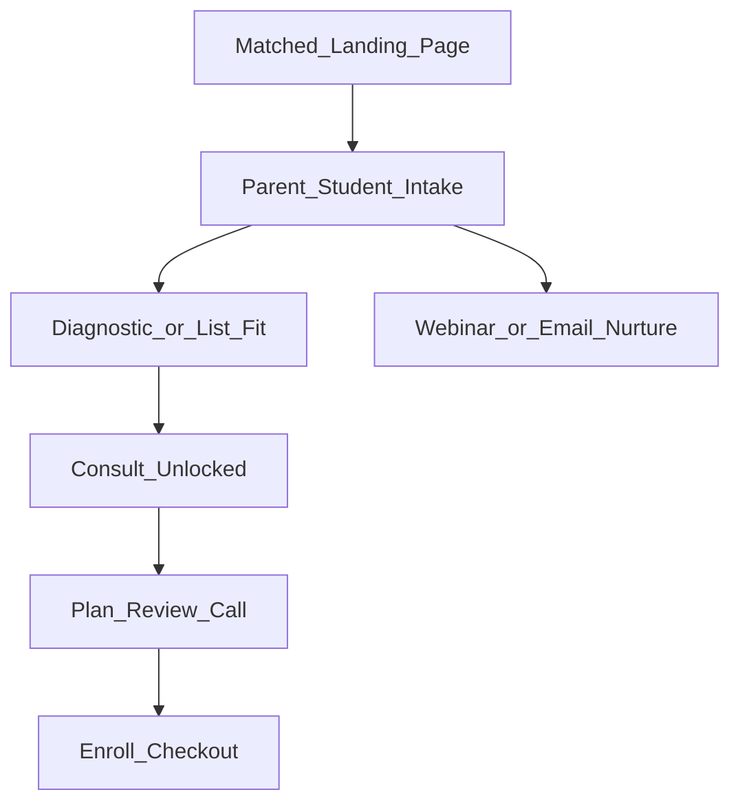
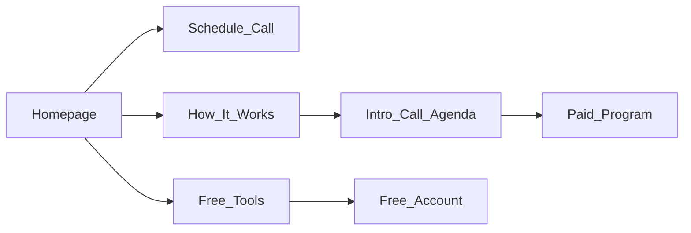
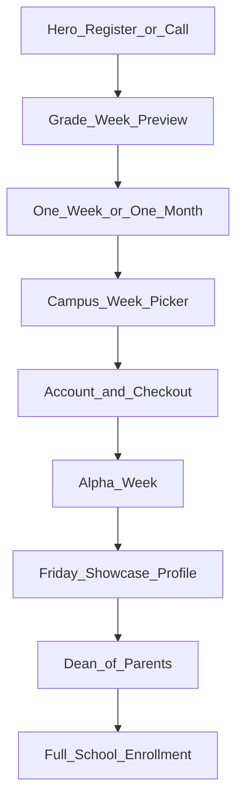
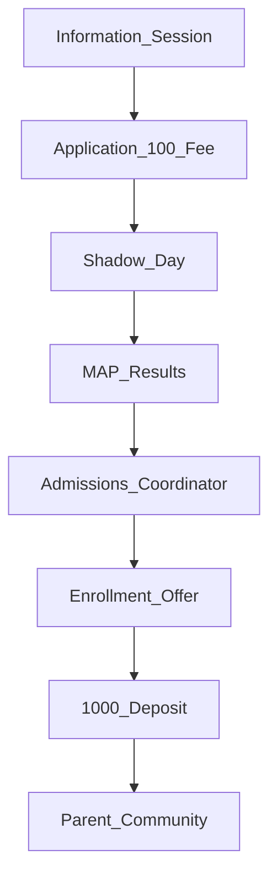
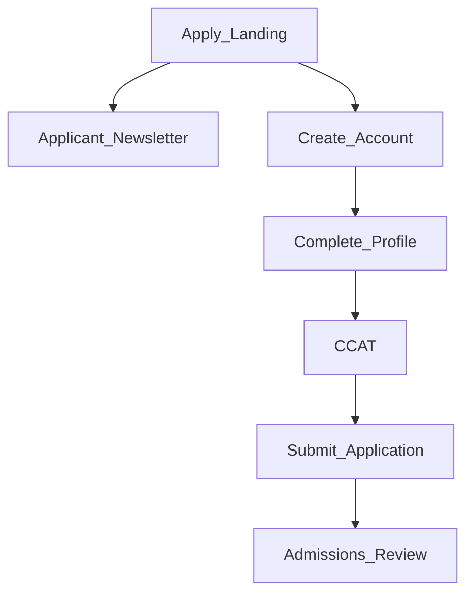
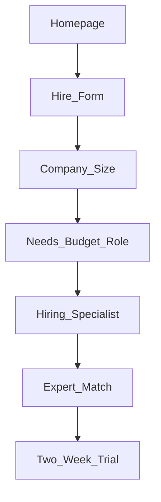

# Premium application funnel teardowns

*Internal research. Snapshot date: 2026-05-18.*

**Purpose:** Compare premium, selective, and consult-led education funnels that Illuminairy can borrow from for the SAT Accelerator path: paid landing page -> intake -> consult -> enroll.

**Related:** [SAT funnel PRD](../../specs/2026-05-sat-funnel/PRD.md), [PostHog funnel dashboard](../../growth/posthog-funnel-dashboard.md), [Curious Cardinals funnel](cc-get-started-funnel.md), [parent voice research](parent-voice-social-listening-2026-05.md).

**Guardrails:** This document is for internal strategy. Do not copy claims about admissions, score outcomes, salary outcomes, AI acceleration, or acceptance rates unless Illuminairy can substantiate them. Public facts for Illuminairy stay in [`lib/site.ts`](../../lib/site.ts).

---

## Executive takeaways

The most useful pattern is not one competitor's full funnel. It is a hybrid:

1. **Curious Cardinals:** parent-first Typeform intake before scheduling, with a call vs event branch.
2. **Alpha School:** diagnostic or trial experience before the close, then a structured review call.
3. **Gauntlet AI:** application checklist, progress state, and locked next steps.
4. **MarketerHire:** one-question-at-a-time qualification before a specialist call.
5. **Cohort:** clear consult agenda, published price anchor, and free tools as a lighter path.

For Illuminairy, the best near-term model is:



The application should feel selective and structured, but not falsely exclusive. The strongest trust builder is a visible plan: what we learned from the intake, what the diagnostic says, and how the 12-week program maps to the August SAT.

---

## Screenshot manifest

Screenshots were captured during the browser walkthrough and should be stored under `docs/research/funnel-screenshots/` when exporting from Cursor's screenshot store.

| Screenshot | Funnel moment | Notes |
|------------|---------------|-------|
| `gauntlet-01-apply-landing.png` | Gauntlet apply landing | Email capture + "Start Shipping" elite positioning |
| `gauntlet-02-application-dashboard.png` | Gauntlet in-app checklist | User-provided reference: account, profile, CCAT, submit, review |
| `intro-01-home-modal.png` | Intro home modal | Founder social proof + email gate |
| `intro-02-signup-email.png` | Intro signup | Email-only account creation + 20K+ proof |
| `marketerhire-01-home.png` | MarketerHire homepage | "Elite Marketing Experts" + proof + two-week trial |
| `marketerhire-hire-01-employees.png` | MarketerHire `/hire` step 1 | Company-size qualification, one question per screen |
| `cohort-01-home.png` | Cohort homepage | Near-peer college counseling, published price, call CTA |
| `cohort-02-how-it-works.png` | Cohort how-it-works | 1:1 mentorship, strategy sessions, platform, consult agenda |
| `alpha-summer-01-home.png` | Alpha Summer hero | "One week. By Friday, you'll know" |
| `alpha-summer-02-enrollment-picker.png` | Alpha Summer enrollment | Campus/week picker, Atlanta from $1,500/wk |
| `alpha-admission-01-process.png` | Alpha full-school admissions | Info session -> application -> Shadow Day -> deposit |
| `synthesis-tutor-pricing.png` | Synthesis Tutor | Commodity self-serve pricing; no application funnel |

---

## Comparison matrix

| # | Company | Funding / scale signal | Price signal | Funnel shape | Primary CTA | What to borrow | Relevance |
|---:|---------|------------------------|--------------|--------------|-------------|----------------|-----------|
| 1 | [Curious Cardinals](https://www.curiouscardinals.com) | ~$4-7M, Anthos/Audacious; 10k+ student claim | ~$380/mo | Two-step parent/student Typeform -> call or Luma event | Get started | Parent intake before calendar, price acknowledgment, webinar off-ramp | 5 |
| 2 | [Cohort](https://bycohort.com) | Bootstrapped / small team; 300+ families claim | $600-$700/school year | Consult-first + free tools | Schedule a call | Published price vs incumbents, consult agenda, free tools | 5 |
| 3 | [Alpha Summer](https://summer.alpha.school) | Liemandt-backed; 23 campuses; heavy press | From $1,500/wk | Register or consult -> week/month trial -> Friday proof -> upsell | Register / Schedule a call | Trial-to-proof framing, diagnostic/profile close, Atlanta relevance | 5 |
| 4 | [Alpha School Admissions](https://alpha.school/admission/) | Liemandt-backed private school expansion | $100 application, $1,000 deposit | Info session -> paid app -> Shadow Day -> MAP review -> deposit | Attend info session / apply | Assessment-review close, required next-step checklist | 5 |
| 5 | [Gauntlet AI](https://www.gauntletai.com/apply) | Hiring partner + government contract signal; elite AI fellowship | No cost to accepted fellows | Long LP -> account -> profile -> CCAT -> submit -> review | Apply / email capture | Gated checklist, readiness test, locked admissions steps | 4 |
| 6 | [MarketerHire](https://marketerhire.com) | ~$14M total funding | $5k-$20k+/mo after consult | LP -> one-question intake -> specialist call -> match -> trial | Hire Marketers | Typeform-style qualification and low-risk trial language | 4 |
| 7 | [Intro.co](https://intro.co) | ~$26M, a16z + 776 | $30-$2,000+/session | Modal email gate -> expert marketplace -> account -> book | Sign up / book expert | Expert cards, face-driven trust, transparent session pricing | 3 |
| 8 | [Crimson Education](https://www.crimsoneducation.org/us) | ~$40M Series D, ~$640M valuation; global admissions brand | High-ticket, consult priced | Free consultation -> candidacy assessment -> roadmap -> package | Book consultation | Proof density, consult agenda, roadmap framing | 5 |
| 9 | [TKS](https://www.tks.world) | Global teen accelerator; institutional support | ~$5.9k-$7.4k plus deposit | Application overview -> selective 10-month program | Start application | Identity-based application for ambitious teens, deadlines | 4 |
| 10 | [Primer](https://primer.com) | $15M Series A; Founders Fund/Khosla/Sam Altman/Naval | Often $0-$3k after scholarships | Apply/waitlist for microschool | Apply / join | "Ambitious kids" positioning, scholarship-access framing | 3 |
| 11 | [Prep Expert](https://prepexpert.com) | Shark Tank / Mark Cuban; $20M+ revenue reporting | Course/tutoring tiers | Free class/webinar -> offer -> course/tutoring | Free class | SAT-specific webinar funnel and founder authority | 3 |
| 12 | [Reforge](https://reforge.com) | $21M Series A, later $60M Series B; acquired by Miro | $1,995/yr individual; team tiers | Membership -> live course enrollment -> community | Join / pricing | Membership as credential, artifact library, operator proof | 2 |
| 13 | [Section](https://www.sectionai.com) | $37M total; General Catalyst/Learn/GSV | Sprint / membership pricing varies | Cohort sprint -> AI/business curriculum -> enterprise | Explore programs | Sprint packaging, business outcome curriculum | 2 |
| 14 | [Maven](https://maven.com) | $20M Series A, a16z; acquired by Reforge ecosystem | Creator-course pricing varies | Course waitlist/application -> cohort | Join course / teach | Start-date urgency, instructor brand as trust | 2 |
| 15 | [On Deck](https://www.joinodf.com) | Historically venture-backed fellowship network | ~$2,990 for VC fellowship | Application -> video -> alumni interview -> cohort | Apply | Acceptance-rate scarcity, application windows | 2 |
| 16 | [Formation](https://formation.dev) | $4M seed led by a16z | High-ticket / outcome-linked training | Apply -> personalized fellowship -> until hired | Apply | Personalized plan, mentor matching, adaptive pacing | 2 |
| 17 | [Pathrise](https://pathrise.com) | ~$26M+ Series A/B | ISA, pay after hire | Apply -> 1-2 week review -> two-week free trial | Apply | Free trial after acceptance, pay-on-outcome positioning | 2 |
| 18 | [BloomTech](https://www.bloomtech.com) | ~$149M funding history | ISA/deferred/upfront options | Account -> eligibility -> tuition choice -> enrollment | Apply | Financing explanation and eligibility routing | 1 |
| 19 | [Flatiron School](https://flatironschool.com) | VC-funded, later acquired | ~$9.9k-$14.9k | Application -> assessment -> interview -> decision | Apply | Admissions sequence and aptitude screen | 1 |
| 20 | [Synthesis Tutor](https://www.synthesis.com/tutor) | ~$17M+ historical Synthesis funding | $119/year or $29/mo | Self-serve trial -> subscription | Try free | Product demo and SpaceX origin story only | 1 |

---

## Funnel teardowns

### Curious Cardinals

**Shape:** parent intake -> student intake -> schedule a consult or attend event.

```mermaid
flowchart TD
  cta[CTA] --> parent[Parent_Info_Typeform]
  parent --> student[Student_Info_Typeform]
  student --> confirm[Price_and_call_commitment]
  confirm --> call[HubSpot_Consult]
  confirm --> event[Luma_Event]
  call --> match[Mentor_Match]
```

**What works:**

- The first form captures parent identity and UTMs before any branch.
- The second form collects program fit, goals, grade, and student details.
- A statement screen confirms willingness to invest around $380/month and attend the call.
- The event branch saves lower-intent parents instead of forcing a call.

**Illuminairy translation:** keep `/get-started` as the qualifying path, but add a schedule vs nurture split after intake. A recorded "week-one diagnostics walkthrough" could play the same role as CC's Luma branch.

### Cohort

**Shape:** consult-first, supported by free tools.



**What works:**

- The offer is legible: $600-$700/school year compared with $6,000+ counseling.
- The call agenda is explicit: where the student is, next-step suggestions, and how Cohort helps.
- Free tools provide a lighter conversion path without devaluing the paid program.

**Illuminairy translation:** make the schedule page say exactly what the consult covers: diagnostic review, target-school list-fit, pacing plan, and whether the August program is a fit.

### Alpha Summer

**Shape:** pay-first trial week or month, followed by a proof event and enrollment conversation.



**What works:**

- "One week. By Friday, you'll know" turns a high-ticket school decision into a bounded proof experience.
- The week preview makes the offer tangible before payment.
- Tuesday MAP snapshot, Friday showcase, student profile, and Dean of Parents conversation create a strong closing ritual.
- The Atlanta campus is directly relevant to Georgia families.

**Illuminairy translation:** the SAT analog is not a paid trial week. It is a visible proof path: intake -> diagnostic snapshot -> consult plan -> enroll. The closest usable copy idea is "by the end of the first diagnostic review, you will know what is blocking progress and what the August plan should be."

### Alpha School admissions

**Shape:** info session, paid application, Shadow Day, assessment review, deposit.



**What works:**

- The process explains every stage before the family starts.
- The Shadow Day gives the student an experience and the school data.
- The close is not generic: it reviews MAP results, Shadow Day feedback, and academic goals.
- Parent onboarding starts immediately through Dean of Parents and ParentSquare.

**Illuminairy translation:** the consult should be a review meeting, not a generic sales call. For SAT, review list-fit, practice history, pacing issues, target date, and the 12-week structure.

### Gauntlet AI

**Shape:** long-form elite landing page, then a productized admissions checklist.



**What works:**

- The sidebar and checklist make progress visible.
- Steps are locked until prior actions are done.
- The aptitude test is positioned as a serious gate.
- Outcome cards reinforce why the friction is worth it.

**Illuminairy translation:** use a parent-facing status pattern after intake: "Student details complete", "diagnostic/list-fit complete", "consult unlocked", "enrollment decision".

### MarketerHire

**Shape:** one-question qualification before a specialist call.



**What works:**

- The form starts with a simple qualification question, not a long wall of fields.
- The timeline is concrete: less than two minutes, days to match, two weeks to working.
- Price comes after scoping, but public FAQ sets expectations at $5k-$20k+/month.

**Illuminairy translation:** keep intake bite-sized. Add a parent budget/readiness question before consult, but keep the public $1,200 tuition clear.

### Intro.co

**Shape:** trust-heavy marketplace with an email-first account gate.

**What works:**

- The home modal uses a founder face and "priority access" before asking for anything.
- Expert cards combine name, rating, credential, and price.
- Signup is email-only, reducing first-step friction.

**Illuminairy translation:** mentor proof should be visual and specific. For SAT, "mentor trained on digital SAT pacing" matters more than a generic directory.

### Crimson Education

**Shape:** free consultation, candidacy assessment, roadmap, and package recommendation.

**What works:**

- The consult is framed as an assessment, not a sales call.
- Public proof is dense: Ivy/top-school offers, global reach, personalized teams.
- The call promises options aligned to family needs and budget.

**Illuminairy translation:** position the consult as a candid diagnostic review: where the student stands, what needs to change by August, and which support path fits.

### TKS

**Shape:** identity-based application for ambitious teens.

**What works:**

- The program is for a specific student identity: ambitious, curious, builder-oriented teens.
- The timeline and deposit make commitment concrete.
- Financial aid keeps selectivity from reading as only wealth access.

**Illuminairy translation:** use identity carefully: "serious August SAT families" is stronger than "elite students." Avoid language that implies admissions or score guarantees.

### Primer

**Shape:** school application/waitlist with state scholarship positioning.

**What works:**

- "Ambitious kids" is a strong parent identity.
- Scholarship framing lowers cost anxiety without cheapening the product.
- The school model is tangible and local.

**Illuminairy translation:** for Georgia, frame affordability against franchise centers and private tutoring while keeping the SAT program premium.

### Prep Expert

**Shape:** founder-led SAT webinar / free class into paid SAT/ACT courses.

```mermaid
flowchart LR
  ad[Ad_or_Search] --> class[Free_Class]
  class --> founder[Founder_Secrets_Webinar]
  founder --> offer[Course_or_Tutoring_Offer]
  offer --> checkout[Checkout]
```

**What works:**

- The founder story is memorable: perfect-score origin + Shark Tank.
- The webinar gives parents a taste of tactics before the offer.
- It is SAT-specific, unlike most broader education competitors.

**What not to borrow:** Prep Expert leans on score-increase guarantee language. Illuminairy should not use guarantee language. Borrow founder authority, strategy walkthroughs, and urgency around test dates.

### Reforge, Section, Maven, and On Deck

These are less directly useful for SAT families, but useful for packaging:

| Company | Useful pattern | Illuminairy translation |
|---------|----------------|------------------------|
| Reforge | Annual membership and artifact library | Parent resource library / practice artifacts after enrollment |
| Section | Short intensive sprints and executive-led proof | "12-week sprint to August SAT" language internally; avoid "cohort" in public copy |
| Maven | Start-date urgency and instructor brand | Fixed August program start windows and mentor credibility |
| On Deck | Application windows, video intro, alumni network | Application window for limited seats; no video unless operationally needed |

---

## Borrow kits

### CC kit: parent qualification before calendar

- Step 1: parent contact + UTMs.
- Step 2: student grade, goals, target schools, practice history.
- Step 3: tuition acknowledgment: "SAT Accelerator tuition is $1,200. Is that within the range you are considering if the program is a fit?"
- Step 4: branch to consult or nurture.
- Step 5: pass all context to CRM and Calendly.

**Best fit:** Immediate improvement to consult quality.

### Gauntlet kit: visible application progress

- Create a post-intake status state, even if it is simple.
- Show completed and locked steps: intake complete, diagnostic/list-fit complete, consult unlocked, enrollment decision.
- Treat the diagnostic as a progress gate, not just a worksheet.
- Use proof cards below the checklist: parent reports, pacing wins, practice consistency.

**Best fit:** Families who need structure and reassurance after submitting intake.

### MarketerHire kit: one-question qualification

- Make each question easy to answer on mobile.
- Start with a non-threatening qualifier.
- Save the budget/readiness question for after value is established.
- Give a clear timeline: "2 minutes to apply, one consult to map the plan, 12 weeks to execute."

**Best fit:** Paid mobile traffic.

### Alpha kit: diagnostic review close

- Make "what happens by Friday" into "what happens after diagnostics."
- Give parents a concrete artifact: diagnostic snapshot, list-fit view, pacing plan, and weekly report preview.
- Treat the consult as a review meeting.
- Build a parent communication ritual immediately after enrollment.

**Best fit:** Premium trust and high-ticket conversion.

### Cohort / Crimson kit: consult agenda and proof

- Explain the call agenda before scheduling.
- Show price compared with common alternatives.
- Use outcome proof only when substantiated.
- Use free tools as a capture path for parents not ready to book.

**Best fit:** SEO and warm paid traffic.

---

## Analytics map

| Competitor stage | Illuminairy event | Notes |
|------------------|-------------------|-------|
| Landing page view | `funnel_landing_view` | Include `variant`, `campaign_id`, `tone`, `fear_id` |
| CTA to apply / schedule | `funnel_cta_click` | Distinguish consult vs intake vs tool |
| Typeform-style question | `intake_step_view` | Existing steps: parent, student, fit |
| Application/intake complete | `intake_completed` + GA4 `generate_lead` | Existing north-star lead event |
| Diagnostic/list-fit complete | `list_fit_completed` | Use as readiness/proof event |
| Consult unlocked | `application_checklist_step` | New optional event if checklist UI ships |
| Schedule page | `schedule_page_view` | Existing |
| Nurture branch | `lead_nurture_branch` | New optional event for webinar/email off-ramp |

---

## Gap analysis: Illuminairy `/get-started` vs best patterns

### 1. Add a visible consult agenda

Borrow from Cohort and Crimson. The schedule page should tell parents the consult will cover:

- where the student is now,
- whether the target schools and August SAT timeline are realistic,
- what the diagnostic or list-fit data suggests,
- how the 12-week SAT Accelerator would work,
- whether the program is the right fit.

### 2. Add a readiness or price acknowledgment

Borrow from CC and MarketerHire. Before scheduling, ask one clear question:

> SAT Accelerator tuition is $1,200. If the program is a fit, is that within the range your family is considering for August SAT prep?

This is not a hard rejection gate. It helps route families to consult vs nurture.

### 3. Make the diagnostic the proof artifact

Borrow from Alpha. The consult should have a concrete artifact: diagnostic snapshot, pacing risks, target-score context, and what week one fixes first.

### 4. Add a nurture off-ramp

Borrow from CC and Prep Expert. Parents who are not ready to book can choose:

- a recorded "August SAT plan" walkthrough,
- the Georgia List Fit Check,
- a guide download,
- email reminders tied to the August test date.

### 5. Consider a lightweight application-status page

Borrow from Gauntlet, but keep it simple. After intake:

```text
1. Intake received
2. Student details complete
3. Diagnostic/list-fit ready
4. Consult scheduled
5. Enrollment decision
```

This can be a future enhancement; do not block the current funnel on it.

### 6. Keep the product surface honest

Avoid:

- score guarantees,
- admissions promises,
- fake scarcity,
- "10x learning" claims,
- public use of "cohort" language.

Use:

- max 10 per class only when operationally true,
- $1,200 from [`lib/site.ts`](../../lib/site.ts),
- diagnostics, pacing, weekly reports, and clear test-date urgency.

---

## Recommended next implementation sequence

1. Update `/get-started/schedule` copy with a consult agenda and "what we review" section.
2. Add a budget/readiness field to intake, with CRM capture.
3. Add nurture branch copy after intake for families who do not schedule.
4. Add a diagnostic/list-fit summary artifact to the consult workflow.
5. Defer checklist UI until the current funnel has enough traffic to justify the extra surface.

