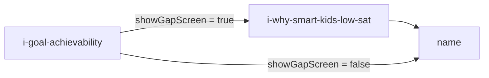

# Plan reveal drop playbook — Jun 7–8 cohort

Post-plan micro-funnel diagnosis for **Plan Builder** (`/plan`). Use this window only for ad-attributed drop decisions. Do **not** use pre–Jun 7 or 30-day reveal→name counts (owner/test traffic skews them).

**Related plan:** `plan-reveal-drop-diagnosis`, `post-plan-value-bridge`, `v1-below-fold-ux`, `name-step-parent-drop`  
**PostHog project:** [428901](https://us.posthog.com/project/428901) · **Replay list:** [Jun 7–8 /plan sessions](https://us.posthog.com/project/428901/replay)

---

## Cohort filters (required)

| Filter | Rule |
|--------|------|
| **Date** | `2026-06-07 00:00:00 UTC` ≤ `timestamp` < `2026-06-09 00:00:00 UTC` |
| **Attribution** | `properties.utm_source IS NOT NULL AND != ''` |
| **Owner / test emails** | Exclude `person.properties.email IN ('noelbrianna@gmail.com', 'testemial@gmail.com', 'brianna@illuminairy.com', 'support@illuminairy.com')` |
| **Reveal entry** | Person has `quiz_step_viewed` with `step IN ('achievability','reveal','s1')` on `/plan` |
| **Direct traffic** | Excluded by utm rule (3 midnight-SF direct sessions on Jun 7 — not in cohort) |

---

## Complete funnel — every screen (Jun 7–8 UTC, attributed only)

**Filters:** same as cohort table above (`utm_source` set; owner/test emails excluded).  
**Metrics:** unique `person_id` per row · **Forward** = also viewed the **next screen in their route** (branch-aware where noted).  
**Source:** PostHog HogQL 2026-06-08 · SSOT route: [`quiz-route.ts`](lib/quiz-funnel/quiz-route.ts)

### Pre-quiz (landing → Plan Builder entry)

| # | Event / step ID | Proposed name | Screen | Users | Forward | Drop |
|--:|-----------------|---------------|--------|------:|--------:|-----:|
| 0 | `funnel_landing_view` | `lp-view` | SAT parent LP (`/` or `/sat-plan-builder`) | **148** | **20** CTA | 128 |
| 1 | `funnel_cta_click` | `lp-cta-click` | LP primary CTA → `/plan` | **20** | **20** `quiz_started` | 0 |
| 2 | `quiz_started` | `quiz-started` | First lifetime funnel start (analytics) | **20** | **18** `q-who` | 2 |

### Base route (fixed order — all paths start here)

| # | Step ID | Proposed name | Screen (parent sees) | Users | Forward to next | Drop |
|--:|---------|---------------|----------------------|------:|----------------:|-----:|
| 3 | `q-who` | `q-who-audience` | Who are you building this SAT plan for? | **18** | **14** → `q-score-lower` | 4 |
| 4 | `q-score-lower` | `q-score-lower-than-expected` | Did their score come back lower than expected? | **14** | **12** → `q1` | 2 |
| 5 | `q1` | `q-urgency-trigger` | What feels most urgent right now? | **14** | **12** → `q2` | 2 |
| 6 | `q2` | `q-stakes` | What's at stake (merit / reach / timing)? | **12** | **12** → `q3` | 0 |
| 7 | `q3` | `q-sat-attempts` | How many times have they taken the SAT? | **12** | **12** → `i-steps` *(or branch)* | 0 |
| 8 | `i-steps` | **`i-plan-preview-sophia`** | “By the end of this, we’ll build a SAT plan like Sophia’s” + sample plan card | **12** *(2d)* | **10** → `q4` naive | **Jun 8 alone: 9/9 (100%)** — Jun 7 had 1 true stuck pre-CTA fix |
| 9 | `q4` | `q-recent-score` | Most recent SAT score band | **10** | **9** → `q-doubts` or `q5` | 1 |
| 10 | `q-doubts` | `q-parent-doubts` | What have you heard from your child? *(parent only)* | **7** | **6** → `doubts-insight` or `q5` | 1 |
| 11 | `q5` | `q-next-test-date` | When is their next SAT? | **9** | **9** → `hit-outcome-month-one` | 0 |
| 12 | `hit-outcome-month-one` | `hit-first-month-outcome` | First-month outcome stat (Illuminairy) | **9** | **9** → `q6` *(or branch)* | 0 |
| 13 | `q6` | `q-blocker` | Biggest blocker (multi-select) | **9** | **9** → `q7` | 0 |
| 14 | `q7` | `q-prep-tried` | What have they tried so far? (multi) | **9** | **9** → `hit-q7` | 0 |
| 15 | `hit-q7` | `hit-prep-failure` | Prep failure insight (Khan breadth, etc.) | **9** | **9** → `i-diag` | 0 |
| 16 | `i-diag` | `i-diagnosis` | Diagnosis insight (5–6 skills frame) | **9** | **9** → `i-compare` | 0 |
| 17 | `i-compare` | `i-compare-prep` | Prep methods comparison | **9** | **9** → **`q9`** | 0 |
| 18 | **`q9`** | **`q-gpa`** *(rename)* | **GPA band question** (`QFQ9GPA`) | **9** | **9** → **`q8`** | 0 |
| 19 | **`q8`** | **`q-goal-score`** *(rename)* | **Goal score question** (`QFQ8Goal`) | **9** | **9** → `achievability` | 0 |
| 20 | `achievability` | `i-goal-achievability` | Score projection + achievability rating | **9** | **9** → `i-gap` or `name` | 0 |
| 21 | `name` | `name` | First name · CTA “Build my plan” | **10** | **6** → `i2` | **4** |
| 22 | `i2` | `i-building-plan-computing` | “Building {name}'s SAT plan” | **6** | **6** → `v1` | 0 |
| 23 | `v1` | `i-plan-revealed` | Personalized SAT plan + TBD skills | **6** | **5** → `s4` | 1 |
| 24 | `s4` | `s4-handoff` | Next steps / Strategy Call handoff | **5** | **5** → `s5` | 0 |
| 25 | `s5` | `s5-lead-booking` | Contact form + Calendly slot picker | **6** | **1** lead submit | 5 |

### Conditional inserts (exact position in route)

These **splice into** the base order when answers match — they are not alternate funnels.

| Insert after / before | Step ID | Proposed name | When shown | Users (Jun 7–8) | Forward |
|-----------------------|---------|---------------|------------|----------------:|--------:|
| **After `q3`** (replaces `q4` + `q-doubts`) | `hit-q3-none` | `hit-no-prior-sat` | `q3 = none` | **1** | → `i-steps` |
| **After `q-doubts`** | `doubts-insight` | `i-doubts-echo` | Any doubt selected | **6** | **6** → `q5` |
| **Before `q6`** | `hit-q5-tbd` | `hit-test-date-tbd` | `q5` is `tbd` or `2027` | **1** | **1** → `q6` |
| **Before `q9`** *(resume/deeplink only)* | `hit-q8-scores` | `hit-goal-tbd` | Saved `q8 = tbd` | **0** | — |
| **Before `name`** | `i-gap` | **`i-why-smart-kids-low-sat`** | High GPA + low/mid score band | **6** | **6** → `name` |

**Skip rules:** `q-doubts` removed entirely when `qWho=self` (student path).

### Post-booking terminal

| # | Event / step ID | Proposed name | Screen | Users | Forward |
|--:|-----------------|---------------|--------|------:|--------:|
| 26 | `quiz_lead_submitted` | `lead-submitted` | s5 form POST success | **1** | **1** booked |
| 27 | `quiz_booking_confirmed` | `call-booked` | Calendly API confirm | **1** | **1** thank-you |
| 28 | `quiz_thank_you_viewed` | `booked-thank-you` | Strategy Call booked thank-you (`booked` step) | **1** | — |

### GPA / goal score — IDs vs visit order

**Yes, `q9` comes before `q8` in the live route.** That is confusing only because the **IDs are legacy mislabels**:

| Visit order | Step ID today | Answer key | Question | Proposed ID |
|------------:|---------------|------------|----------|-------------|
| 18th question | **`q9`** | `answers.q9` | **GPA** | **`q-gpa`** |
| 19th question | **`q8`** | `answers.q8` | **Goal score** | **`q-goal-score`** |

**Visit order is already GPA → goal.** Fix is **rename IDs** (and CRM/analytics aliases), not swap screens — unless product wants **goal before GPA** (different decision).

### Is conditional logic causing drop-off?

**No — not the main driver in this window.**

| Hypothesis | Evidence Jun 7–8 |
|------------|------------------|
| Conditionals “skip” people | Skips are **by design** (`i-gap`, `q-doubts` on student path). Everyone who qualifies still gets the next base step. |
| Conditionals add friction | **`i-gap` → `name` 6/6 (100%)** · **`doubts-insight` → `q5` 6/6 (100%)** · inserts are rare (`hit-q3-none` 1, `hit-q5-tbd` 1) |
| Funnel feels long | **148 LP → 20 CTA (86% never start)** is the biggest leak · early quiz **`q-who` → `q-score-lower` (4 left)** · late leak **`name` → `i2` (4 left)** |
| Conditionals vs fixed length | Base route already has **~23 screens** before booking; conditionals add **0–2** screens for most users |

**Primary leaks (attributed, Jun 7–8):** LP view → CTA · early `q-who` / `q-score-lower` · **`name` before plan reveal** · **`s5` form → lead submit (6 viewed, 1 submitted)**.

---

## Jun 7–8 results (achievability cohort n=9)

### Step names — current PostHog ID vs proposed (owner 2026-06-08)

| PostHog / route ID today | Proposed label | Component | What parent sees |
|--------------------------|----------------|-----------|------------------|
| `achievability` | **`i-goal-achievability`** | `QFSPlanReveal` | Score projection + “Goal score achievability rating” |
| `i-gap` (conditional) | **`i-why-smart-kids-low-sat`** | `QFIGPAGap` | “Why smart kids score low on the SAT” — only some paths |
| **`name`** | **`name`** (keep) | **`QFQName`** | Eyebrow “One last detail”; first-name field; CTA **“Build my plan”** — **before plan is built/revealed** |
| `i2` | **`i-building-plan-computing`** | `QFI2Compute` | “Building {name}'s SAT plan” → **“Reveal {name}'s plan”** |
| `v1` | **`i-plan-revealed`** | `QFV1Projection` | **“Personalized SAT plan”** + chart + TBD skills — **parent-facing plan reveal** |

Registry rename (`achievability` → `i-goal-achievability`, etc.) is **Phase B** in plan — analytics aliases until shipped. This doc uses **proposed labels** for clarity; HogQL still uses current IDs.

### Canonical Plan Builder step order (SSOT: [`quiz-route.ts`](lib/quiz-funnel/quiz-route.ts))

**GPA is `q9`. It is asked ~15 steps into the funnel — not next to `i-gap`.** `i-gap` uses GPA **answers already saved** from `q9`, but the screen appears **after** goal score (`q8`) and achievability projection.

| # | Step ID | Type | What it is |
|--:|---------|------|------------|
| 1 | `q-who` | question | Who is this for (parent vs student) |
| 2 | `q-score-lower` | question | Score lower than expected |
| 3 | `q1` | question | What feels most urgent |
| 4 | `q2` | question | Stakes |
| 5 | `q3` | question | Times taken SAT |
| 6 | `i-steps` | **`i-plan-preview-sophia`** | Sophia plan preview (“build a plan like Sophia’s”) |
| 7 | `q4` | question | Most recent SAT score band |
| 8 | `q-doubts` | question | Parent doubts (skipped if `qWho=self`) |
| 9 | `q5` | question | Next SAT date |
| 10 | `hit-outcome-month-one` | hit | First-month outcome stat |
| 11 | `q6` | question | Biggest blocker (multi) |
| 12 | `q7` | question | What they tried (multi) |
| 13 | `hit-q7` | hit | Prep failure insight |
| 14 | `i-diag` | interstitial | Diagnosis insight |
| 15 | `i-compare` | interstitial | Prep methods comparison |
| 16 | **`q9`** | **question** | **GPA band** (`QFQ9GPA`) |
| 17 | **`q8`** | question | Goal score |
| 18 | **`achievability`** | interstitial | Score projection + achievability rating |
| 19 | **`i-gap`** *(conditional)* | interstitial | **Proposed rename: `i-why-smart-kids-low-sat`** — only if `showGapScreen()` |
| 20 | **`name`** | question | First name; CTA “Build my plan” |
| 21 | `i2` | interstitial | “Building {name}'s SAT plan” |
| 22 | `v1` | interstitial | Personalized SAT plan (parent-facing reveal) |
| 23 | `s4` | schedule | Handoff |
| 24 | `s5` | form | Contact + Strategy Call booking |

**Conditional inserts** (splice into base order when answers match):

| Step ID | Insert | When |
|---------|--------|------|
| `hit-q3-none` | after `q3` | `q3 = none` (also removes `q4`, `q-doubts`) |
| `doubts-insight` | after `q-doubts` | doubts selected |
| `hit-q5-tbd` | before `q6` | `q5` is `tbd` or `2027` |
| `hit-q8-scores` | before `q9` | `q8 = tbd` |
| **`i-gap`** → **`i-why-smart-kids-low-sat`** | **before `name`** | high GPA (`q9` 3.0+) **and** low/mid score (`q4` u1000–1300-1400, not `na`, not `1400plus`) |

**Two valid paths after achievability:**



### `i-why-smart-kids-low-sat` (today: `i-gap`)

**Screen content** (`QFIGPAGap`, CTA **`I_GAP_CTA`** = “Final question”):

- Headline: **“Why smart kids score low on the SAT.”**
- Body: high-GPA vs SAT pacing contrast
- Two cards: **School rewards taking your time** vs **SAT rewards moving fast**

**Not the same as GPA question:** `q9` collects the GPA band. This interstitial **explains** the GPA/SAT mismatch using `q4` + `q9` already on file.

### Late-funnel forward conversion (Jun 7–8, n=9 achievability cohort)

**Method:** For each step pair, count users who **viewed step A** and also **viewed step B** (next screen in route). Conditional steps get **branch-specific** pairs — do not collapse `i-gap` into a single ach→name line.

| From → To | Saw A | Also saw B | Forward % | Drop on A |
|-----------|------:|-----------:|----------:|----------:|
| `q9` → `q8` | 9 | 9 | **100%** | 0 |
| `q8` → `achievability` | 9 | 9 | **100%** | 0 |
| `achievability` → `i-gap` | 9 | 6 | 67% eligible | 0 *(3 skip by rule)* |
| **`i-gap` → `name`** | **6** | **6** | **100%** | **0** |
| `achievability` → `name` *(skip i-gap path)* | 3 | 3 | **100%** | 0 |
| **`name` → `i2`** | 9 | 6 | **67%** | **3** |
| `name` → `i2` *(had i-gap)* | 6 | 5 | **83%** | 1 |
| `name` → `i2` *(skipped i-gap)* | 3 | 1 | **33%** | 2 |
| `i2` → `v1` | 6 | 6 | **100%** | 0 |
| `v1` → `s4` | 6 | 5 | **83%** | 1 |
| `s4` → `s5` | 5 | 5 | **100%** | 0 |

**Headline:** **`i-gap` has zero forward drop** (6/6 continued to `name`). **All Jun 7–8 loss is after that:** **`name` → `i2` (3 users, 33%)**, then **`v1` → `s4` (1 user)**.

**Route:** `i-goal-achievability` → [`i-why-smart-kids-low-sat`?] → **`name`** → `i-building-plan-computing` → `i-plan-revealed` → `s4` → `s5`

**Headline (correct framing):** **3 of 9 (33%) dropped on the `name` screen** — before i2/v1 — not “failed to see the plan.”

**Among the 6 who passed `name`:** **5 of 6 (83%) reached `s5`**. Post-name flow is strong; **one** concerned_mom parent exited at `i-plan-revealed` without reaching s4.

### `name` screen — identity and drop

| | |
|--|--|
| **Route / PostHog** | `step=name` |
| **Component** | `QFQName` ([`app/quiz/screens/Questions.jsx`](app/quiz/screens/Questions.jsx)) |
| **Position** | After projection (`achievability`); **before** `i2` / plan reveal |
| **CTA** | `NAME_CTA` = **“Build my plan”** ([`score-path-copy.ts`](lib/quiz-funnel/score-path-copy.ts)) |
| **Drop** | **9 → 6** continue to `i2` (**3 users**) |

### Parent vs student at `name` drop

All **3** name-screen leavers: **`qWho=child` (parent path)** — building plan for their child.

| person (short) | qWho | utm | Passed name → i2? |
|----------------|------|-----|-------------------|
| ad5 parent | child | ad5_high_gpa_student_story | **No** |
| concerned_mom | child | concerned_mom_good_grades_low_sat | **No** (back/rage) |
| ad3 no-score | child | ad3_before_tutoring | **No** |

**Both student paths (`qWho=self`) in cohort passed `name` and reached `s5`.** Small n (2 students), but name gate aligns with **parent** friction, not student blackout.

### Verdict vs old narrative

- **Wrong:** “9 → 6 never saw v1 / plan reveal” as the headline — frames plan as the problem.
- **Wrong:** “0% drop reveal→name” — name is **before** reveal.
- **Right:** **Name request before plan reveal** is the primary Jun 7–8 leak; **defer, soften, or move name** is the main product question. Copy/CTA on **`i-goal-achievability`** matters secondarily (gets them to name).

### Why achievability “looked like” it dropped (but didn’t in the clean cohort)

| Query mistake | What you see | Jun 7–8 example |
|---------------|--------------|-----------------|
| **Raw step counts** (no cohort anchor) | `name` can **exceed** `achievability` | Unfiltered: **14** achievability vs **15** name (resume/deep link to `name` without a reveal event in-window) |
| **30d, no utm filter** | Small reveal→name leak | Jun 1–8 all traffic: **18 → 17** (1 leaver = **direct**, no utm) |
| **Event count vs users** | Looks like churn on reveal | **14** achievability **events** but **9** users (back-nav: one user **4×** on reveal) |
| **PostHog strict funnel** | Can show drop if steps mis-ordered | Must anchor cohort on reveal viewers; optional **`i-gap`** sits between reveal and name |

**Attributed cohort (correct product-order funnel):** **name → i2 = 9 → 6 (33% drop)** — never reached build/reveal. **v1 → s4 = 6 → 5**. ach → name 9→9 is **not** a finding (consecutive steps).

The **22 → 17** figure does **not** reproduce on Jun 7–8 attributed data. It comes from **broader windows + unfiltered traffic + funnel definitions that don’t require “saw reveal first.”**

### Achievability: one route step, two UI surfaces — plus **v1 is the parent “plan reveal”**

**Engineering vs parent language (owner correction):**

| | Engineering / PostHog | Parent experience |
|--|----------------------|-------------------|
| **First projection** | `step=achievability` (`QFSPlanReveal`, `buildPlanReveal`) | “Is my target realistic?” — achievability rating, not the plan document |
| **Loading beat** | `step=i2` | “Building {name}'s SAT plan” |
| **The plan document** | `step=v1` (`QFV1Projection`) | **“Personalized SAT plan”** + chart + `{Name}'s SAT Plan` — **this is what parents call the reveal** |
| **CTA that says “Reveal”** | `i2` button: **“Reveal {name}'s plan”** | Leads into **v1**, not achievability |

Code names the **`achievability`** step “plan reveal” ([`Results.jsx`](app/quiz/screens/Results.jsx), [`plan-reveal.ts`](lib/quiz-funnel/plan-reveal.ts)). **Parents who complete the arc** hit **name → i2 → v1** before they see that card. **3/4 Jun 7–8 droppers never reached v1.**

**Route / analytics (`quiz_step_viewed.step`):**

| Step ID | Component | Notes |
|---------|-----------|--------|
| **`achievability`** | `QFSPlanReveal` | **Only ID fired in production** (Jun 7–8: 9 users, 0 `reveal`, 0 `s1`) |
| `reveal`, `s1` | Same `QFSPlanReveal` | Deep-link **aliases** in [`QuizRunner.tsx`](app/quiz/QuizRunner.tsx); same screen |
| **`i-gap`** (optional) | `QFIGPAGap` | Inserted **between** achievability and name when GPA gap screen applies — **not** titled achievability |
| **`v1`** | `QFV1Projection` | **Separate step** after name → i2; eyebrow **“Personalized SAT plan”** |

**On-screen “achievability” labeling (parent sees this twice, different steps):**

1. **Plan reveal** (`step=achievability`): H1 = score projection + verdict (`PlanRevealContent`); includes **`AchievabilityPlanBlock`** with label **“Goal score achievability rating”** (tier pills + stat bar).
2. **v1 projection** (`step=v1`): Card eyebrow **“Personalized SAT plan”**; **same `AchievabilityPlanBlock`** again (duplicate gauge) + TBD skill rows below.

So: **one funnel step** named achievability in PostHog, but **two screens** show the achievability rating widget (reveal + v1). Easy to think there are “two achievability steps” when reviewing replays.

**Route order (relevant slice):** `i-compare` → `q9` → `q8` → **`achievability`** → [`i-gap` if gap] → **`name`** → `i2` → **`v1`** → `s4` → `s5` ([`quiz-route.ts`](lib/quiz-funnel/quiz-route.ts)).

**Funnel reporting recommendation:** Report in product order: **achievability → name → i2 → v1 → s4 → s5**. Primary KPIs: **name → v1** (saw plan doc), **v1 → s4** (continued after reveal). Do not headline achievability → name.

---

| Drop | n | Who | Primary tags |
|------|--:|-----|--------------|
| **`name` screen** (never reached build/reveal) | **3** | **All parent (`qWho=child`)** | `name_step_drop`, `name_before_plan` |
| **`i-plan-revealed` → no s4** | 1 | Parent | `felt_done_at_v1`, `v1_below_fold` |
| **`s5` completers** | 5 | 4 parent + 2 student paths (6 passed name) | Post-name flow works for most |

---

## HogQL templates

### Cohort funnel counts

```sql
SELECT
  count(DISTINCT if(properties.step IN ('achievability','reveal','s1'), person_id, NULL)) AS reveal_users,
  count(DISTINCT if(properties.step = 'name', person_id, NULL)) AS name_users,
  count(DISTINCT if(properties.step = 'v1', person_id, NULL)) AS v1_users,
  count(DISTINCT if(properties.step = 's4', person_id, NULL)) AS s4_users,
  count(DISTINCT if(properties.step = 's5', person_id, NULL)) AS s5_users
FROM events
WHERE timestamp >= toDateTime('2026-06-07 00:00:00')
  AND timestamp < toDateTime('2026-06-09 00:00:00')
  AND event = 'quiz_step_viewed'
  AND properties.$current_url ILIKE '%/plan%'
  AND properties.utm_source IS NOT NULL AND properties.utm_source != ''
  AND ifNull(person.properties.email, '') NOT IN (
    'noelbrianna@gmail.com', 'testemial@gmail.com',
    'brianna@illuminairy.com', 'support@illuminairy.com'
  )
  AND person_id IN (
    SELECT person_id FROM events
    WHERE timestamp >= toDateTime('2026-06-07 00:00:00')
      AND timestamp < toDateTime('2026-06-09 00:00:00')
      AND event = 'quiz_step_viewed'
      AND properties.step IN ('achievability','reveal','s1')
      AND properties.$current_url ILIKE '%/plan%'
  )
LIMIT 100
```

### name → v1 droppers

```sql
SELECT person_id,
  max(if(properties.step = 'name', 1, 0)) AS name,
  max(if(properties.step = 'v1', 1, 0)) AS v1,
  argMax(if(properties.step = 'name', properties.q4, NULL),
    if(properties.step = 'name', timestamp, toDateTime('1970-01-01'))) AS q4_at_name,
  argMax(if(properties.step = 'name', properties.utm_content, NULL),
    if(properties.step = 'name', timestamp, toDateTime('1970-01-01'))) AS utm_at_name
FROM events
WHERE timestamp >= toDateTime('2026-06-07 00:00:00')
  AND timestamp < toDateTime('2026-06-09 00:00:00')
  AND event = 'quiz_step_viewed'
  AND properties.$current_url ILIKE '%/plan%'
  AND properties.utm_source IS NOT NULL AND properties.utm_source != ''
  AND ifNull(person.properties.email, '') NOT IN (
    'noelbrianna@gmail.com', 'testemial@gmail.com',
    'brianna@illuminairy.com', 'support@illuminairy.com'
  )
  AND person_id IN (/* reveal cohort subquery */)
GROUP BY person_id
HAVING name = 1 AND v1 = 0
LIMIT 100
```

### Session recordings (/plan, date range)

Use MCP `query-session-recordings-list`:

```json
{
  "date_from": "2026-06-07",
  "date_to": "2026-06-09",
  "filter_test_accounts": true,
  "properties": [
    { "key": "visited_page", "operator": "icontains", "type": "recording", "value": "/plan" }
  ],
  "limit": 50
}
```

Deep link format: `https://us.posthog.com/project/428901/replay/{recording_id}?t={seconds}`

---

## Replay rubric (apply per session)

Tag each reveal cohort session. Multiple tags OK.

| Tag | Definition |
|-----|------------|
| `felt_done_at_achievability` | ≤5s on **`achievability`** (projection) before Continue; left before **v1** |
| `felt_done_at_v1` | Reached **`v1`** (“Personalized SAT plan” card) then left quickly — **parent-facing reveal** |
| `name_before_plan` | Stalled at **`name`** — plan doc (v1) still behind i2 |
| `name_friction` | Stops on name without submit; backs out; rageclicks; pageleave within ~15s of name view |
| `v1_below_fold` | Reaches v1 but no scroll / instant exit; TBD disclaimer likely unseen |
| `back_navigation` | Back from name or reveal to edit answers |
| `rageclick` | `$rageclick` on name, back, or post-reveal |
| `completer_fast` | reveal → s5 in &lt;3 min with minimal hesitation |
| `completer_slow` | Same but &gt;5 min on post-reveal steps or long v1 dwell |

**Instrumentation gaps (add in code):** `quiz_step_dwell`, scroll depth on v1/reveal, `quiz_plan_reveal_continue`, `quiz_v1_continue`, `quiz_step_back`. `achievability_input_edited` — **not in taxonomy** as of Jun 8.

---

## Session tags — full reveal cohort (n=9)

Event-derived dwell = seconds between consecutive `quiz_step_viewed` on same person (approximate; back-nav breaks ordering).

### Droppers (4)

| # | utm_content | qWho | Outcome | Replay | Dwell (reveal / name / v1) | Tags | Notes |
|---|-------------|------|---------|--------|---------------------------|------|-------|
| 1 | `ad5_high_gpa_student_story` | child (parent) | **Drop at name** (never v1) | [019ea698…](https://us.posthog.com/project/428901/replay/019ea698-8394-777c-ba03-695d48c4d41b?t=115) | ~4s / ~0s / — | `felt_done_at_achievability`, `name_before_plan`, `name_friction` | Fast Continue on **projection**; pageleave at name. Not a v1 reveal drop. |
| 2 | `concerned_mom_good_grades_low_sat` | child | **Drop at name** (never v1) | [019ea4fd…](https://us.posthog.com/project/428901/replay/019ea4fd-258d-722a-b0ed-aa3e5d20e14f?t=117) | ~4s / ~11s / — | `name_friction`, `back_navigation`, `rageclick` | Back from name; never reached i2/v1. |
| 3 | `ad3_before_tutoring` | child | **Drop at name** (never v1) | [019ea45e…](https://us.posthog.com/project/428901/replay/019ea45e-230b-7e03-aa35-db718839b2da?t=286) | multi-view / ~0s / — | `back_navigation`, `name_before_plan`, `name_friction` | 4× **achievability** views; stopped at name. |
| 4 | `concerned_mom_good_grades_low_sat` | child | **Drop at v1** | [019ea4d6…](https://us.posthog.com/project/428901/replay/019ea4d6-b893-70b0-b3f9-6312cb8b55aa?t=156) | ~5s / ~11s / **&lt;1s** | **`felt_done_at_v1`**, `v1_below_fold` | Only dropper who saw **parent plan reveal** (v1); instant exit. |

### Completers (5)

| # | utm_content | qWho | Outcome | Replay | Dwell (reveal / name / v1) | Tags | Notes |
|---|-------------|------|---------|--------|---------------------------|------|-------|
| 5 | `ad5_high_gpa_student_story` | self (student) | **s5** | [019ea48b…](https://us.posthog.com/project/428901/replay/019ea48b-a838-7e52-8642-3b902e760cbb) | ~13s / ~45s / ~16s | `completer_slow` | Student path; 276s recording; reached booking step. Contrast to ad5 **parent** drop (#1). |
| 6 | `ad3_before_tutoring` | child | **s5** | [019ea74b…](https://us.posthog.com/project/428901/replay/019ea74b-040a-775e-82c1-4c775baa1a5d) | ~20s / ~7s / ~2s | `completer_fast` | Parent; blitz through v1→s4→s5 (~11s post-v1). |
| 7 | `ad3_before_tutoring` | child | **s5** | [019ea50c…](https://us.posthog.com/project/428901/replay/019ea50c-42ec-70a3-bc0b-8d5436e8eaa7) | ~10s / ~24s / ~5s | `completer_fast` | Parent; steady progression. |
| 8 | `ad3_before_tutoring` | self | **s5** | [019ea50b…](https://us.posthog.com/project/428901/replay/019ea50b-670b-78a6-9546-8504bbce9183) | ~1s / ~5s / ~28s | `completer_slow`, `back_navigation` | Student; **back-nav after s5** (revisited v1/name/reveal). Still counted as s5 reach. |
| 9 | `concerned_mom_good_grades_low_sat` | child | **s5** | [019ea598…](https://us.posthog.com/project/428901/replay/019ea598-953c-7b27-aa9f-d9e8af14733a) | ~32s / ~27s / ~58s | `completer_slow` | Longest session (666s); **58s on v1** (only completer with long v1 dwell). |

---

## Hypothesis scoring (Jun 7–8 evidence)

| Hypothesis | Score | Evidence |
|------------|-------|----------|
| **A+ Post-plan motivation gap** | **High** | Split by screen: **achievability** fast-continue + **name gate** (3/4 droppers, never saw v1); **`felt_done_at_v1`** (1/4) |
| **F v1 gimmick / below fold** | **Medium–High for v1** | Applies to **v1 parent reveal**, not achievability projection |
| **Name step friction** | **High** | **Name before i2/v1 plan doc** — “Build my plan” before they see “Personalized SAT plan” |
| **Name gate before plan** | **High** | **name → i2** 9→6; name step precedes i2/v1 |
| **Reveal score edit confusion** | **Low–medium** | #3 only (ad3, no score path); multiple achievability views |

---

## Recommended copy/UX actions (after this pass)

**Owner gate:** No reveal-page changes until playbook review + explicit CTA approval. See plan § *Reveal CTA — owner review gate*.

Priority order from replay tags (post-approval):

1. **`post-plan-value-bridge`** — Reframe reveal as **preview**; reveal CTA TBD (candidates: “Diagnose my/their 5–6 skills”, “Find my/their highest-impact skills”, or bridge “See what's still TBD”); fix name CTA (“Build my plan” after plan shown).
2. **`name-step-parent-drop`** — Defer name to s5 or explain unlock; ad5 parent (#1) is canonical repro.
3. **`v1-below-fold-ux`** — Move TBD / Skill Diagnostic unlock line above fold; test scroll cue (#4).
4. **`rageclick-fix`** — concerned_mom parent (#2): back button loop from name.
5. **Instrumentation** — `quiz_step_dwell`, scroll depth, `quiz_step_back` (back loops invisible in funnel today).

---

## Re-run checklist (weekly while ads live)

1. Shift date window in SQL (keep utm + email exclusions).
2. Refresh funnel table; only act if n≥10 per step or pattern repeats 2+ weeks.
3. Pull new `/plan` recordings (`visited_page icontains /plan`).
4. Run `session-recording-summarize` on new droppers with focus: post-reveal behavior.
5. Update session table below; link insights to `post-plan-value-bridge` / `v1-below-fold-ux` PRs.

---

## Analysis log

| Date | Analyst | Window | Notes |
|------|---------|--------|-------|
| 2026-06-08 | Cursor agent (PostHog MCP) | Jun 7–8 UTC | Initial cohort n=9; 4 dropout replays AI-summarized; 5 completers event-tagged |
